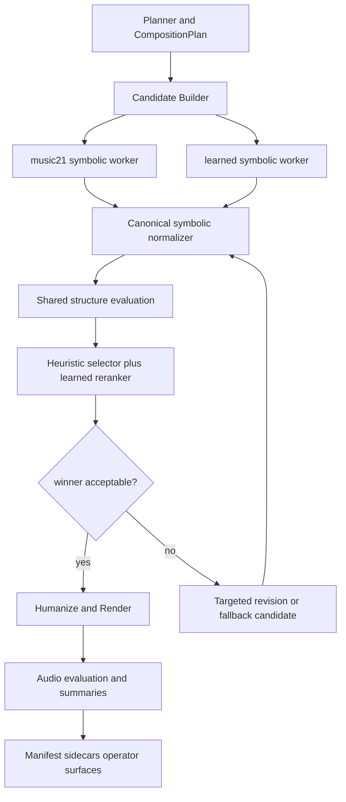

# AXIOM Multi-Model Composition Pipeline

## Goal

AXIOM already has a real planning layer, section-aware structure evaluation, audio evaluation, targeted retries, and operator summaries.
The next long-term planning cycle should stop describing a shallow request-only system, but it should also stop treating musical quality as an expression-only problem.

The roadmap now needs three connected tracks:

1. State the current musical reality honestly.
2. Turn phrase, harmony, texture, and expression into a first-class planning and runtime contract.
3. Add external corroboration only after the internal musical contract is stable.

This keeps the roadmap aligned with the current runtime instead of planning against an older architecture snapshot.

## Current Runtime Reality

Current AXIOM state:

1. The planner already emits `request`, `plan`, `selectedModels`, top-level `rationale`, and `inspirationSnapshot` in [src/autonomy/service.ts](src/autonomy/service.ts).
2. [src/pipeline/types.ts](src/pipeline/types.ts) already contains `CompositionPlan`, `SectionPlan`, `ModelBinding`, `ComposeQualityPolicy`, `StructureEvaluationReport`, `AudioEvaluationReport`, and section artifact types.
3. [src/autonomy/request.ts](src/autonomy/request.ts) already hashes `workflow`, `selectedModels`, `compositionPlan`, `qualityPolicy`, and `revisionDirectives`, not just prompt text.
4. [src/pipeline/orchestrator.ts](src/pipeline/orchestrator.ts) already runs structure evaluation, audio evaluation, targeted retries, and summary generation.
5. [src/pipeline/evaluation.ts](src/pipeline/evaluation.ts) already measures structural and audio narrative fit, tonal return, harmonic route, and weakest sections.
6. [src/pipeline/quality.ts](src/pipeline/quality.ts) already turns evaluation results into localized revision directives.
7. Persisted manifest and recovery behavior under `outputs/_system/` and `outputs/<songId>/` are compatibility surfaces and must remain stable.
8. The symbolic composer is currently best described as a section-aware sketch engine: it can respect form sections, cadence intent, harmonic route, and expression cues, but it does not yet model phrase rhetoric, inner-voice independence, or orchestral conversation at composer grade.
9. `audio_only` remains a fast audio lane and should not be documented as equivalent to the symbolic classical-composition lane.
10. Symbolic render still consumes a single global SoundFont path, so timbre upgrades are currently runtime-wide rather than request-scoped.
11. The `music21` compose worker still defaults to two concrete parts, one lead-or-counterline part and one accompaniment part, but short chamber-like requests can now split tagged `inner_voice` or `counterline` motion into a dedicated third MIDI part when separate secondary and bass instruments are provided.
12. For `symbolic_plus_audio`, the canonical `audio` artifact remains the score-aligned rendered WAV; prompt-regenerated output belongs only in `styledAudio`.

## Remaining Gaps

The main gaps are no longer basic planning or workflow routing.
The main gaps are:

1. Phrase grammar is still shallow. Sections exist, but sentence, period, continuation pressure, hypermeter, and cadential rhetoric are only lightly modeled.
2. Harmony is still mostly template-driven. Global route and cadence checks exist, but prolongation, harmonic rhythm control, inner-voice logic, and a reusable color vocabulary for mixture, applied dominant, suspension, pedal, or evaded-cadential behavior are still under-modeled.
3. Texture is still lead-plus-accompaniment first in many cases. Counterline and inner-voice requests now surface heuristic secondary-line independence and contrary-motion metrics, short symbolic keyboard textures can now emit explicit middle- or upper-strand accompaniment events tagged with their realized secondary role, explicit short chamber-like plans can now split that tagged secondary strand into a dedicated output MIDI part when instrumentation separates secondary and bass roles, and targeted retries can bias only the weak section toward a stronger moving strand, but imitation and richer contrapuntal generation are not yet first-class generative objects.
4. Expression is richer than before, but it still needs to sit on top of phrase and texture instead of compensating for them. Dynamics, articulation, tempo motion, and local holds can now survive as planned cues, but phrase breath, arrival, release, and harmonic arrival timing are still only indirectly represented.
5. `audio_only` remains a separate fast audio lane and bypasses most symbolic musical checks.
6. The quality loop can localize cadence, harmony, tension, expression, and some texture-survival issues, and short symbolic keyboard imitation checks can now use explicit role-tagged secondary-strand event evidence, but it still cannot reliably score phrase rhetoric or large-scale contrapuntal clarity.
7. Autonomy preferences now learn reusable phrase functions, texture/counterpoint plans, harmonic pacing/voicing patterns, prolongation modes, and simplified tonicization-window summaries.
8. Long-span form is still under-modeled. AXIOM can retain section-local intent, but it does not yet reliably plan or verify exposition-development-recap inevitability, long-delay payoff, or multi-section thematic transformation over extended spans.
9. Orchestration and instrument idiom are still mostly deferred. Timbre quality has improved, but register handoff, ensemble balance, doubling strategy, and family-specific gesture design are not yet first-class planning or evaluation objects.
10. Authorial identity is still generic. The system can reuse craft patterns, but it does not yet sustain a recognizable voice or repertoire-specific rhetoric across multiple approved works strongly enough to justify master-composer-level claims.

## Planning Principles

1. Reliability first: startup, restart recovery, queue behavior, and operator surfaces remain compatible.
2. Expression before external providers: planner and runtime must know what `pp`, `crescendo`, `legato`, or `dolce` mean before any external evaluator is introduced.
3. Optional providers only: external analysis must be non-blocking, degradable, and visible in health or operator surfaces.
4. Sidecars over manifest bloat: rich new data should prefer sidecar artifacts rather than expanding `manifest.json` indefinitely.
5. Determinism over novelty: planner decisions and prompt hashes should not depend on live network calls.

## Near-Term Timbre Plan

The next timbre-quality slice should stay narrower than orchestration expansion.
AXIOM should first improve the default symbolic render sound without changing request contracts, recovery behavior, or operator surfaces.

Near-term rules:

1. Improve the single global GM SoundFont before adding request-scoped library selection.
2. Prefer drop-in GM SoundFonts that work directly with the current FluidSynth path.
3. Keep `audio_only` and MusicGen quality work separate from symbolic timbre upgrades.
4. Defer SFZ, VST, and single-family specialty libraries until the runtime can select timbre per request or per section.

Current first-pass GM SoundFont status:

1. `MuseScore_General.sf3` is now the adopted runtime default.
2. `GeneralUser GS 2.0.3` remains the primary comparison and rollback candidate.
3. `MuseScore_General.sf2` as a fallback when `.sf3` packaging or startup behavior becomes operationally inconvenient.

Not first-pass candidates:

1. Piano-only banks such as `Salamander C5 Light`.
2. Non-GM or unclear-contract libraries that would underuse the current two-part symbolic path.
3. SFZ or VST-based orchestral libraries before request-scoped timbre selection exists.

## Target Musical Architecture

The target architecture should treat musical quality as four stacked contracts:

1. Phrase contract
   - Each section should declare phrase function, cadence role, and expected rhetorical motion.

2. Harmony contract
   - Plans should express harmonic rhythm, local tonicization windows, and cadence type rather than only coarse tonal centers.

3. Texture contract
   - Plans should name voice roles such as lead, bass, inner voice, counterline, and chordal support.

4. Expression contract
   - Dynamics, articulation, and character should shape already-coherent phrase and texture behavior, not replace them.

Operationally, this means AXIOM should keep `audio_only` as a distinct fast lane while the symbolic lane remains the canonical classical-composition path.

## Target Pipeline

Recommended workflow stages:

1. `PLAN`
   - Input: recent manifests, recent weaknesses, operator preferences, optional day context.
   - Output: `CompositionPlan` with structure and expression intent.

2. `STRUCTURE`
   - Input: `CompositionPlan`.
   - Output: symbolic draft, section artifacts, and structural metadata.

3. optional `ORCHESTRATE`
   - Input: symbolic draft plus instrumentation plan.
   - Output: richer symbolic texture or orchestration.
   - Note: this remains optional until the current structure-first path needs a dedicated orchestration pass.

4. `EXPRESSION_REALIZE`
   - Input: section expression guidance plus symbolic material.
   - Output: expression-aware MIDI behavior and an expression sidecar.
   - In the first implementation this lives inside the existing compose, humanize, and render path rather than as a separate worker.

5. `RENDER_STYLE`
   - Input: symbolic output plus timbre or style path.
   - Output: rendered audio and preview assets.

6. `EVALUATE_STRUCTURE`
   - Input: symbolic draft, section plan, harmonic plan, section artifacts.
   - Output: structure evaluation report.

7. `EVALUATE_AUDIO`
   - Input: rendered audio plus plan summary.
   - Output: audio evaluation report.

8. optional `EVALUATE_EXTERNAL`
   - Input: rendered audio plus optional provider policy.
   - Output: corroboration-only external report.
   - This stage must remain optional and non-blocking.

9. `SUMMARIZE`
   - Input: evaluation reports.
   - Output: operator-facing summary.

## Core Contract Additions

The next contract change is not another high-level workflow enum.
It is a musical contract with lightweight phrase and texture hooks, with expression as the first fully realized slice.

```ts
export type PhraseFunction = "presentation" | "continuation" | "cadential" | "transition" | "developmental";

export type TextureRole = "lead" | "counterline" | "inner_voice" | "bass" | "chordal_support";

export interface TextureGuidance {
   voiceCount?: number;
   primaryRoles?: TextureRole[];
   counterpointMode?: "none" | "imitative" | "contrary_motion" | "free";
   notes?: string[];
}
```

```ts
export type DynamicLevel = "pp" | "p" | "mp" | "mf" | "f" | "ff";

export type HairpinShape = "crescendo" | "diminuendo";

export type ArticulationTag =
   | "legato"
   | "staccato"
   | "staccatissimo"
   | "tenuto"
   | "sostenuto"
   | "accent"
   | "marcato";

export type CharacterTag =
   | "dolce"
   | "dolcissimo"
   | "espressivo"
   | "cantabile"
   | "agitato"
   | "tranquillo"
   | "energico"
   | "grazioso"
   | "brillante"
   | "giocoso"
   | "leggiero"
   | "maestoso"
   | "scherzando"
   | "pastorale"
   | "tempestoso"
   | "appassionato"
   | "delicato";

export interface DynamicsProfile {
    start?: DynamicLevel;
    peak?: DynamicLevel;
    end?: DynamicLevel;
    hairpins?: Array<{
        shape: HairpinShape;
        startMeasure?: number;
        endMeasure?: number;
        target?: DynamicLevel;
    }>;
}

export interface ExpressionGuidance {
    dynamics?: DynamicsProfile;
    articulation?: ArticulationTag[];
    character?: CharacterTag[];
    phrasePeaks?: number[];
    sustainBias?: number;
    accentBias?: number;
    notes?: string[];
}
```

Recommended additions to existing plan types:

```ts
export interface SectionPlan {
    // existing fields...
   phraseFunction?: PhraseFunction;
   texture?: TextureGuidance;
    expression?: ExpressionGuidance;
}

export interface CompositionPlan {
    // existing fields...
   textureDefaults?: TextureGuidance;
    expressionDefaults?: ExpressionGuidance;
}
```

The first pass should keep these fields optional and backward compatible.

The current vocabulary is already wider than the first expression pass. What is still missing is not more raw tags, but a stable realization table that maps those tags into measurable symbolic and rendering behavior.

## Near-Term Contract Additions

The next planning increment should add two focused contracts rather than another broad schema rewrite.

### Tempo-Motion Contract

Use musical motion cues as section-local behavior rather than treating tempo only as a piece-wide scalar.

```ts
export type TempoMotionTag =
   | "ritardando"
   | "rallentando"
   | "allargando"
   | "accelerando"
   | "stringendo"
   | "a_tempo"
   | "ritenuto"
   | "tempo_l_istesso";

export interface TempoMotionPlan {
   tag: TempoMotionTag;
   startMeasure?: number;
   endMeasure?: number;
   intensity?: number;
   notes?: string[];
}
```

### Ornament Contract

Ornaments should be introduced as a narrow, optional symbolic contract. The planner may request them before the composer can generate them comprehensively, but the runtime should model them explicitly rather than hiding them in freeform notes.

```ts
export type OrnamentTag = "grace_note" | "trill" | "mordent" | "turn" | "arpeggio" | "fermata";

export interface OrnamentPlan {
   tag: OrnamentTag;
   sectionId?: string;
   targetBeat?: number;
   intensity?: number;
   notes?: string[];
}
```

## Optional External Corroboration Contract

External validation should be modeled as a late optional layer, not as a prerequisite for planning.

```ts
export interface ExternalValidationPolicy {
    enableEssentia?: boolean;
    enableFingerprinting?: boolean;
}

export interface ExternalCorroborationReport {
    providers: Array<{
        name: "essentia" | "chromaprint" | "acoustid" | "musicbrainz" | "listenbrainz" | "critiquebrainz";
        mode: "local" | "remote";
        confidence?: number;
        strengths: string[];
        issues: string[];
    }>;
}
```

This is intentionally separate from the first increment.

## Completed Foundations

The first architectural pass is no longer hypothetical. The current runtime already has these foundations:

1. Planner output is now plan-centric rather than prompt-only: [src/autonomy/service.ts](src/autonomy/service.ts) emits structured `request`, `plan`, `selectedModels`, `rationale`, `inspirationSnapshot`, and novelty telemetry.
2. Phrase, texture, expression, and harmonic pacing or voicing hooks now exist in the runtime contract and normalization path: [src/pipeline/types.ts](src/pipeline/types.ts), [src/pipeline/requestNormalization.ts](src/pipeline/requestNormalization.ts), [src/autonomy/request.ts](src/autonomy/request.ts).
3. `expression-plan.json` and `section-artifacts.json` survive retries and restart recovery: [src/memory/manifest.ts](src/memory/manifest.ts), [src/pipeline/orchestrator.ts](src/pipeline/orchestrator.ts).
4. The symbolic lane already evaluates cue survival for phrase, texture, expression, register, cadence approach, and harmonic route: [src/pipeline/evaluation.ts](src/pipeline/evaluation.ts).
5. The quality loop already emits localized directives for cadence, harmony, phrase, texture, and expression drift: [src/pipeline/quality.ts](src/pipeline/quality.ts).
6. autonomy preferences already accumulate successful motif, tension, register, cadence, bass, section-style, phrase, texture, and harmonic behavior patterns: [src/autonomy/service.ts](src/autonomy/service.ts).
7. Operator-visible docs and approval guidance already describe the current symbolic contract and its limits: [docs/manifest-schema.md](docs/manifest-schema.md), [docs/state-machine.md](docs/state-machine.md), [docs/autonomy-operations.md](docs/autonomy-operations.md).

This means the next cycle should not repeat the first-contract work. The next cycle must move from contract plumbing toward listener-grounded quality and deeper musical craft.

## Current Required Work

The current plan should make an explicit distinction between what is already implemented and what is now actually required.

### Required Now

1. Add structured listener feedback to approval and rejection so AXIOM optimizes toward perceived appeal instead of only internal proxy scores.
2. Turn the expanded expression vocabulary into a realization table in the symbolic, humanizer, and render path so tags like `tenuto`, `marcato`, `tranquillo`, and `grazioso` produce consistent measurable behavior.
3. Add tempo-motion planning for cues like `ritardando`, `accelerando`, and `a tempo`, and pair it with explicit local-hold behavior such as `fermata`, so musical motion is not reduced to a single global BPM.
4. Expose those new planned and realized cues in sidecars, summaries, and operator review surfaces so retries and approvals can reason about them.

### Required Soon

1. Deepen phrase rhetoric and prolongation scoring beyond the current section-aware hooks.
2. Upgrade texture roles from heuristic independence toward more reliable counterline and imitative behavior.
3. Introduce a narrow ornament contract for grace notes, trill-family gestures, turns, arpeggiation, and fermata behavior.

### Explicitly Later

1. External corroboration providers.
2. Canon benchmarking and corpus-scale comparison.
3. Rich engraving or publication-grade notation output.

## Goal Gates

The final goal now has three different bars and they should not be confused.

### Gate A: 사람 기준으로 듣기 좋은 곡

AXIOM should not claim this until all of the following are true:

1. Short-form outputs can be blind-rated by multiple listeners with a stable median appeal score.
2. The planner and quality loop can explain why one approved piece was preferred over another in structured terms.
3. Approval and rejection notes are captured as machine-usable feedback, not only freeform summary text.
4. Listener preference trends change future planning behavior in a measurable way.

### Gate B: 클래식 명곡급 잠재력

AXIOM should not claim this until all of the following are true:

1. It can generate phrase-coherent, harmonically legible, and texturally independent short works across more than one form family.
2. It can sustain those qualities over longer spans than a miniature or nocturne.
3. Expert listeners can distinguish its stronger outputs from mere "pleasant sketches" in blind comparison.
4. External corroboration and human review agree often enough that approval is not mostly a proxy for "no obvious rule break".

### Gate C: 거장급 작곡가 수준 주장

AXIOM should not claim this until all of the following are true:

1. It can sustain clear long-range form, development pressure, and return payoff over works materially longer than the current short-form sweet spot.
2. It can produce instrument-idiomatic chamber or orchestral writing whose register use, balance, voicing, and gesture feel intentional to expert listeners rather than like generic texture assignment.
3. Across multiple approved works, it shows a stable authorial voice or repertoire-specific rhetoric that reads as more than competent generic classicism, without depending on direct named-composer mimicry.
4. Blind comparison, expert review, and external corroboration agree often enough that the claim is not mainly driven by internal proxy scores, operator goodwill, or novelty bias.

The current system is still below all three gates. It is strongest as an autonomous structure-first sketch engine with improving memory, not yet a listener-grounded canon-seeking composer.

## Concrete Roadmap

The roadmap should now be broken into six engineering phases with explicit scope and exit criteria. The first four remain the near-term sequence already underway; phases 5 and 6 are the additional work required before any master-composer-level claim should be entertained.

### Phase 1: Listener-Grounded Evaluation

Goal: stop optimizing only internal proxy metrics and start optimizing toward human-perceived appeal.

Primary scope:

1. Add structured listening feedback to the approval path in [src/autonomy/service.ts](src/autonomy/service.ts) and [src/routes/autonomy.ts](src/routes/autonomy.ts).
2. Extend persisted preference memory in [src/autonomy/types.ts](src/autonomy/types.ts) and [src/memory/manifest.ts](src/memory/manifest.ts) so approval or rejection captures reusable appeal signals and failure reasons.
3. Add an explicit listener-facing summary surface to [src/autonomy/service.ts](src/autonomy/service.ts) and operator docs so approved pieces carry more than `selfAssessment.summary`.
4. Add a comparison-friendly metric layer in [src/pipeline/evaluation.ts](src/pipeline/evaluation.ts) or a sibling module that keeps aesthetic scoring separate from hard pass or fail checks.

Acceptance criteria:

1. `approve` and `reject` can persist structured notes such as appeal score, strongest dimension, weakest dimension, and comparison reference.
2. `outputs/_system/preferences.json` can summarize recurring listener-approved qualities and recurring rejection reasons without breaking backward compatibility.
3. `POST /autonomy/preview` or `GET /autonomy/status` can surface the strongest recent positive and negative human feedback factors.
4. Tests cover feedback persistence, planner reuse of feedback summaries, and backward-compatible loading of old preference files.

Why first:

This phase creates the missing value function. Without it, later musical improvements still optimize mostly toward internal structural proxies.

### Phase 2: Expression Realization and Tempo Motion

Goal: make the expanded musical vocabulary survive the full symbolic-to-render path in a listener-audible way.

Primary scope:

1. Add a stable realization table for the supported articulation and character tags in [workers/composer/compose.py](workers/composer/compose.py), [workers/humanizer/humanize.py](workers/humanizer/humanize.py), [src/humanizer/index.ts](src/humanizer/index.ts), and [src/render/index.ts](src/render/index.ts).
2. Add a tempo-motion contract for section-local cues such as `ritardando`, `rallentando`, `accelerando`, `stringendo`, `a tempo`, and `ritenuto` in [src/pipeline/types.ts](src/pipeline/types.ts), [src/pipeline/requestNormalization.ts](src/pipeline/requestNormalization.ts), [src/autonomy/service.ts](src/autonomy/service.ts), and downstream workers.
3. Persist planned and realized tempo-motion, ornament-hold, and expression evidence in sidecars so retries and recovery do not drop them.
4. Add revision directives that can repair expression flattening, missing dynamic arcs, failed local tempo motion, and weak fermata hold survival in [src/pipeline/quality.ts](src/pipeline/quality.ts).

Acceptance criteria:

1. Supported articulation and character tags produce audibly and measurably different realization behavior instead of surviving only as metadata.
2. Tempo-motion cues can be planned, persisted, realized, and summarized without breaking older requests.
3. Section artifacts and expression sidecars expose enough evidence to judge whether planned expression, tempo motion, and explicit ornament hold survived realization.
4. Retry directives can improve at least one weak expression, tempo-motion, or fermata-hold section in deterministic regression tests.

Why second:

Without this phase, the expanded musical vocabulary remains mostly symbolic annotation rather than audible craft.

### Phase 3: Phrase, Breath, Harmony, and Polyphonic Texture Deepening

Goal: make phrase breath, harmonic vocabulary, and texture roles first-class musical behavior rather than label-level hints.

Primary scope:

1. Extend section planning and sidecars with an explicit phrase-breath contract so pickup, arrival, release, cadence recovery, and local rubato anchors are represented additively rather than inferred only from section length or expression tags.
2. Extend `harmonicPlan` beyond route-only hints into a narrow but intentional harmonic vocabulary family: mixture, applied-dominant targets, suspension or resolution intent, pedal prolongation, sequential or neighbor motion, and cadence color such as deceptive or evaded release.
3. Couple expression realization to those phrase and harmonic events so dynamics, articulation, tempo motion, and ornament cues reinforce pickup, suspension, cadence preparation, arrival, and release instead of floating independently.
4. Extend [src/critic/index.ts](src/critic/index.ts), [src/pipeline/evaluation.ts](src/pipeline/evaluation.ts), and [src/pipeline/quality.ts](src/pipeline/quality.ts) so phrase-breath clarity, cadence release timing, prolongation clarity, harmonic-color survival, texture independence, and imitation quality are judged and repaired more directly.
5. Keep the quality loop localized: weak phrase-breath or harmonic-color sections should produce section-targeted directives and reuse untouched sections or artifacts whenever possible.

Acceptance criteria:

1. A planned short lyric piece can mark at least one pickup or preparation, one local arrival, and one release or cadence-recovery window, and those events survive into sidecars and section artifacts after retries and restart recovery.
2. Harmonic plans can request at least one non-trivial color behavior such as mixture, applied dominant, suspension, pedal, or deceptive reframe without breaking older section-only plans.
3. Render or operator-facing summaries can explain where phrase breath broadened or pressed forward and whether that aligned with harmonic arrival or release.
4. Structure evaluation exposes at least one phrase-breath metric, one cadence-release metric, one prolongation or harmonic-color metric, and one independence or imitation survival metric.
5. Deterministic regression tests show that a targeted weak section can improve without introducing full-piece drift.

Current status:

1. Heuristic secondary-line artifact and evaluation metrics are already in place, short symbolic keyboard textures can now tag realized accompaniment steps as `bass`, `inner_voice`, or `counterline` when they are rendered as note-wise moving strands, short chamber-like plans with explicit secondary and bass instrumentation can now emit that tagged secondary strand into a dedicated third MIDI part, and structure evaluation can reconstruct secondary-line motion or motif evidence directly from those tagged events when precomputed summaries are absent.
2. Symbolic keyboard textures can now strengthen `clarify_texture_plan` retries by biasing only the targeted section toward a more independent counterline-like accompaniment strand while untouched sections reuse prior section artifacts verbatim.
3. Planned `imitative` keyboard sections can now realize note-only upper-strand answer gestures inside the accompaniment track, persist that part-aware contour as `secondaryLineMotif`, and let structure evaluation prefer it over melody-only motif summaries when scoring imitation survival.
4. Humanization now uses expression-plan measure windows plus planned texture roles to differentiate lead versus secondary-voice timing, sustain, and velocity heuristically, split bass versus upper-strand shaping inside one accompaniment part by register or event role, and, for wide shared accompaniment chords, separate lowest, middle, and top notes into bass, subordinate support, and counterline-like subvoice shaping without changing untouched sections.
5. Phrase or harmonic intent fields such as `phraseSpanShape`, `continuationPressure`, `cadentialBuildup`, `prolongationMode`, and `tonicizationWindows` already survive normalization, planner parsing, prompt hashing, and compose-worker outputs, so the next work should deepen and evaluate them rather than replacing the current contract in one jump.

Why third:

This is the biggest missing craft layer between "good sketch" and "convincing classical writing".

#### Focused delivery slices inside Phase 3

##### Slice 3A: Phrase-Breath Contract

Goal:

Make phrase breath a planned and reviewable object instead of an accidental byproduct of section length, default dynamics, or humanizer jitter.

Primary files:

1. [src/pipeline/types.ts](src/pipeline/types.ts)
2. [src/pipeline/requestNormalization.ts](src/pipeline/requestNormalization.ts)
3. [src/autonomy/service.ts](src/autonomy/service.ts)
4. [workers/composer/compose.py](workers/composer/compose.py)
5. [workers/humanizer/humanize.py](workers/humanizer/humanize.py)

Planned contract additions:

1. Add an additive section-level phrase-breath object rather than replacing current phrase fields.
2. Keep the contract narrow: pickup or preparation, local arrival point, release window, cadence recovery, and optional rubato anchors.
3. Persist the planned contract in `expression-plan.json` and summarize realized evidence in `section-artifacts.json`.

Validation:

1. Recovery and targeted retry must preserve phrase-breath windows without changing prompt-hash behavior for unchanged plans.
2. A render or operator summary should be able to say where the section pressed forward, broadened, arrived, and released.

##### Slice 3B: Harmonic Vocabulary Families

Goal:

Broaden harmonic writing from route-only stability checks into reusable color families that still fit a deterministic symbolic engine.

Primary files:

1. [src/pipeline/types.ts](src/pipeline/types.ts)
2. [src/autonomy/service.ts](src/autonomy/service.ts)
3. [workers/composer/compose.py](workers/composer/compose.py)
4. [src/pipeline/evaluation.ts](src/pipeline/evaluation.ts)
5. [src/pipeline/quality.ts](src/pipeline/quality.ts)

Scope rules:

1. Start with a small explicit vocabulary: mixture, applied-dominant targets, predominant color, suspension or resolution intent, pedal plans, sequential motion, and cadence color.
2. Keep these section-scoped and auditable. Do not jump directly to unrestricted chromatic search.
3. Treat harmonic color as a planning family with measurable survival, not only a composer-specific style tag.

Validation:

1. Planned harmonic color must survive into section artifacts and evaluation summaries.
2. Weak color survival should produce targeted repair such as cadence clarification, suspension strengthening, or prolongation stabilization instead of generic whole-piece harmony retries.

##### Slice 3C: Breath-Aware Realization

Goal:

Make the humanizer and render path express planned breath and harmonic arrival, not just generic expressive variation.

Primary files:

1. [workers/humanizer/humanize.py](workers/humanizer/humanize.py)
2. [src/humanizer/index.ts](src/humanizer/index.ts)
3. [src/render/index.ts](src/render/index.ts)
4. [docs/state-machine.md](../state-machine.md)
5. [docs/manifest-schema.md](../manifest-schema.md)

Scope rules:

1. Map pickup, arrival, and release windows onto timing stretch, sustain contrast, downbeat weight, and cadence broadening.
2. Let suspension or pedal intent influence local sustain or overlap behavior where the symbolic material supports it.
3. Keep role-aware shaping intact so breath does not flatten lead versus counterline versus bass differences.

Validation:

1. Humanized sections should show measurable timing and sustain differences at planned arrival and release points.
2. Operator-visible summaries should describe the realized breath or harmonic-arrival behavior without requiring raw MIDI inspection.

##### Slice 3D: Evaluation and Local Repair

Goal:

Turn phrase breath and harmonic color into things the system can critique and repair instead of merely describing.

Primary files:

1. [src/critic/index.ts](src/critic/index.ts)
2. [src/pipeline/evaluation.ts](src/pipeline/evaluation.ts)
3. [src/pipeline/quality.ts](src/pipeline/quality.ts)
4. [src/pipeline/orchestrator.ts](src/pipeline/orchestrator.ts)

Target metrics:

1. Phrase-breath fit: whether planned pickup, arrival, and release events are supported by realized note activity and timing contrast.
2. Cadence-release fit: whether cadence preparation, landing, and aftermath are distinct enough to read as rhetoric rather than as a flat barline event.
3. Harmonic-color fit: whether mixture, applied-dominant, suspension, pedal, or deceptive color survives clearly enough in the realized section.
4. Texture or imitation fit: whether added harmonic color or breath shaping preserved voice independence instead of collapsing it.

Validation:

1. The quality loop can target phrase-breath or harmonic-color directives to a single weak section.
2. Regression tests verify that an unrelated strong section remains byte-stable or artifact-stable when localized repair is applied elsewhere.

#### Guardrails for this track

1. Keep new phrase-breath and harmonic-color fields additive and backward-compatible.
2. Prefer reusable craft primitives over a hard-coded named-composer mode. The near-term goal is better breath, cadence timing, prolongation, and harmonic color, not one-to-one imitation of Chopin, Beethoven, or any other composer.
3. Keep the symbolic lane canonical. `audio_only` should not become the proving ground for phrase-breath or harmonic-vocabulary claims.
4. Avoid unbounded chromatic generation. Expand the vocabulary in explicit families that can be planned, realized, scored, and repaired.

### Phase 4: External Corroboration and Canon Benchmarking

Goal: add a late, optional layer that checks whether strong internal scores correlate with external evidence and human judgment.

Primary scope:

1. Add an optional external evaluation sidecar and contract in the pipeline rather than bloating `manifest.json` directly.
2. Introduce Essentia first for non-blocking phrase segmentation, onset, contrast, and dynamic-arc corroboration.
3. Optionally add Chromaprint or AcoustID for deduplication and reference-matching visibility, not planner determinism.
4. Build a benchmark set of human-approved AXIOM outputs and comparison pieces so external signals are interpreted against a stable corpus, not one-off anecdotes.

Acceptance criteria:

1. External evaluation is optional, non-blocking, and clearly separated from hard runtime availability.
2. Operator surfaces can show when internal and external judgments agree or disagree.
3. The team has a benchmark playlist or corpus for blind comparison, not only single-run approval notes.
4. Docs state clearly that external corroboration is advisory until it has been validated against human listener outcomes.

Why last:

External providers are only useful after the internal musical contract and human feedback loop are strong enough to interpret them.

### Phase 5: Long-Span Form and Thematic Development

Goal: turn local section competence into long-range classical argument rather than a sequence of strong adjacent sketches.

Primary scope:

1. Extend planning with long-span form objects for exposition, development, return, recap, and retransition logic where the chosen form family supports them.
2. Add multi-section thematic transformation checkpoints so the system can track when an opening idea is repeated, destabilized, sequenced, fragmented, revoiced, or delayed before return.
3. Extend evaluation and quality control with long-range metrics for developmental pressure, delayed payoff, recap inevitability, and harmonic timing across section boundaries rather than only within them.
4. Add span-aware repair modes that can revise a weak development or return zone without destabilizing already strong opening or cadence sections.

Acceptance criteria:

1. At least one form family longer than a miniature can preserve clear opening identity, developmental contrast, and return payoff across retries and restart recovery.
2. Evaluation exposes at least one long-span thematic metric, one long-span harmonic-timing metric, and one recap or return-payoff metric.
3. Targeted repair can improve a weak development or recap region without introducing full-piece drift when unrelated sections are already strong.
4. Expert listeners can distinguish successful longer-form outputs from stitched-together short sections in blind comparison.

Why fifth:

This is the missing layer between local craft competence and large-scale classical form.

Current status:

1. `CompositionPlan.longSpanForm` now survives runtime normalization and prompt hashing, so section-id-based exposition/development/return checkpoints are part of the stable request contract.
2. `previewAutonomyPlan` now preserves planner-emitted `longSpanForm` objects, including thematic transformation checkpoints and development/return expectation labels, instead of dropping them before runtime preview.
3. Planner-facing summaries now expose a compact long-span snapshot with named section checkpoints plus thematic checkpoint counts and transform labels, so preview and trigger surfaces can show the intended large-form arc without dumping the full raw plan.
4. Symbolic critique now consumes `longSpanForm` and exposes initial long-span evaluation metrics for thematic transformation fit, return-boundary harmonic timing, development-pressure fit, and return payoff fit when the plan provides explicit checkpoints.
5. Structure quality control now treats weak long-span metrics as retry-worthy when a plan explicitly requests long-span behavior, and it maps those misses to localized development-zone, return-boundary, and payoff-zone revision directives instead of defaulting to whole-piece drift.
6. Persisted `structureEvaluation.longSpan` snapshots now classify explicit long-span plans as `held`, `at_risk`, or `collapsed`, and operator-facing pending approval plus recent-job surfaces expose that compact state without forcing a full metric dump.
7. Persisted `audioEvaluation.longSpan` snapshots now classify rendered long-form survival as `held`, `at_risk`, or `collapsed` using development narrative, recap recall, harmonic-route, and tonal-return fit, and recent-job or backlog operator surfaces can expose that compact state without dumping the full audio metric map.
8. Queue, autonomy, manifest-tracking, and operator surfaces now expose a compact `longSpanDivergence` summary when rendered long-span behavior is weaker than the symbolic long-span hold, so structure-held but audio-collapsed outcomes are explicit instead of implicit.
9. Audio revision routing now treats render-collapsed long-span divergence as retry-worthy and maps it back to development, harmonic-route, or recap-return repair without loosening the symbolic form that already holds.
10. `longSpanDivergence` now also carries primary section ids plus section-level explanations from audio section findings, so operators and repair routing can point at the concrete recap or development zone instead of only a top-level focus label.
11. `longSpanDivergence.sections[]` now pairs those audio-led zones with matching symbolic weakest-section evidence when `structureEvaluation.longSpan` is only partially holding, so queue, autonomy, tracking, and projection surfaces can show side-by-side symbolic vs rendered weakness for the same return or development section.
12. Audio revision routing now distinguishes `longSpanDivergence.repairMode` across `render_only`, `paired_same_section`, and `paired_cross_section`, so paired weak sections get stronger priority and cross-section divergence can target both the rendered weak section and the paired symbolic weak section in one repair pass.
13. Operator-facing compact labels now preserve repair mode in the top line: render-only stays `status:focus@sectionId`, same-section paired becomes `status:focus@sectionId~same`, and cross-section paired becomes `status:focus@audioSectionId>symbolicSectionId`, so backlog and pending digests expose the repair topology without opening JSON.
14. Compact labels now also append secondary divergence sections as `,+...` fragments, so multi-section long-span trouble within the same repair focus can surface without opening the JSON payload.
15. `longSpanDivergence` now carries `secondaryRepairFocuses`, and compact labels promote that as `primaryFocus+secondaryFocus(+Nmore)` before the section fragments, so backlog and pending digests no longer collapse multi-focus render divergence down to a single top-level focus.
16. Triage and operator summary/projection digests now add a short `longSpanReason` prose fragment derived from the primary divergence pairing, so cross-section divergence surfaces can say which rendered weak section must reconverge with which paired symbolic weak section without opening the JSON payload.
17. Audio quality routing now treats `secondaryRepairFocuses` as first-class retry inputs by emitting companion long-span directives alongside the primary repair focus, so multi-focus render collapse can widen the retry bundle beyond a single top-level directive without throwing away the primary symbolic/rendered pairing.
18. `longSpanDivergence` now also exposes `recommendedDirectives[]` bundle entries with per-focus directive mapping and primary-vs-secondary priority class, so downstream operator and analytics tooling can consume the same multi-focus retry bundle without reverse-engineering quality-routing internals from `repairFocus` plus `secondaryRepairFocuses`.

### Phase 6: Orchestration and Idiomatic Writing

Goal: make AXIOM's writing ensemble-aware and instrument-idiomatic rather than timbre-improved two-part competence.

Primary scope:

1. Promote `ORCHESTRATE` from an optional placeholder into an explicit planning and evaluation stage for at least one constrained chamber or ensemble family.
2. Add instrumentation-aware plans for range, register handoff, balance, doubling, articulation burden, and texture rotation across instruments.
3. Extend evaluation with idiomatic-range, balance, voicing-density, and ensemble-conversation metrics that are distinct from generic phrase or harmony scores.
4. Add localized repair directives that can address one weak instrument family, handoff, or balance region without rewriting every part.

Acceptance criteria:

1. At least one constrained chamber family can generate idiomatic parts with stable role rotation and credible register balance.
2. Evaluation exposes at least one idiomatic-range metric, one balance or doubling metric, and one ensemble-conversation metric.
3. Repair directives can improve a weak instrumentation region without flattening the rest of the ensemble.
4. Operator docs and summary surfaces clearly distinguish timbre upgrades from actual orchestration competence.

Initial delivery slice:

1. Start with one explicit family: `string_trio` (`violin`, `viola`, `cello`).
2. Allow `compositionPlan.orchestration` to be provided directly, but derive the same contract automatically when instrumentation and section texture already imply a string trio.
3. Persist orchestration-aware evaluation through `structureEvaluation.orchestration` plus aggregate metrics for idiomatic range, register balance, and ensemble conversation.
4. Reuse existing localized repair directives first (`expand_register`, `clarify_texture_plan`) before introducing a broader orchestration-specific retry taxonomy.
5. Treat this as the first proof point only, not as general orchestration competence for arbitrary ensembles.

Why sixth:

Great classical writing is not only stronger phrase and harmony. It also depends on how material is distributed across instruments, registers, and textures over time.

## Near-Term Delivery Order

If the next two or three implementation slices need to stay small, use this order:

1. Correct operator and docs contracts so `symbolic_plus_audio` keeps rendered WAV as canonical `audio` and stores prompt-regenerated output only in `styledAudio`.
2. Adopt and benchmark one drop-in GM SoundFont replacement. Status: complete with `MuseScore_General.sf3` adopted as the runtime default and `GeneralUser GS 2.0.3` retained as the comparison candidate.
3. Approval or rejection feedback schema and persistence.
4. Planner summary reuse of human feedback in autonomy preview.
5. Phrase-pressure and tonicization or prolongation evaluation additions.
6. Targeted quality directives for the new phrase and harmonic failure modes.
7. Counterline or inner-voice realization for one constrained form family first, preferably short chamber or piano textures.
8. Long-span thematic-development metrics and localized repair for one longer form family.
9. One constrained chamber-orchestration track with instrument-idiomatic planning and evaluation before any broad orchestration claim.

As of 2026-04-18, items 1 through 6 are reflected in the current runtime and tests. In particular, approval and rejection now persist structured review fields into `reviewFeedback`, update `outputs/_system/preferences.json` human-feedback summaries, and expose recent feedback highlights on autonomy status or ops surfaces. Phase 2 has also begun in four narrow realization slices: compose and humanize now preserve and measurably realize extended articulation or character tags such as `tenuto`, `sostenuto`, `marcato`, `tranquillo`, `grazioso`, and `energico` instead of collapsing them to the earlier minimal subset; the runtime now accepts, persists, summarizes, and locally realizes tempo-motion cues such as `ritardando`, `accelerando`, `a tempo`, and `ritenuto` through `compositionPlan`, `expression-plan.json`, render summaries, and humanizer timing shaping; and the same sidecar contract now carries narrow ornament intent with an initial `fermata` realization path plus target-beat `arpeggio`, `grace_note`, and `trill` realization paths for explicit local windows on chord-bearing or note-bearing events. The same humanize pass now writes section-local tempo-motion coverage and direction evidence plus section-local fermata hold, arpeggio onset-spread, grace-note lead-in, or trill oscillation evidence back into `section-artifacts.json`, audio evaluation scores that evidence through `audioTempoMotionPlanFit`, `audioOrnamentPlanFit`, `audioOrnamentArpeggioFit`, `audioOrnamentGraceFit`, and `audioOrnamentTrillFit`, and audio-informed retries can issue localized `shape_tempo_motion` or `shape_ornament_hold` repairs when the cue lands on too little note-bearing material or the hold contrast stays too weak. Mordent and turn still remain metadata-only structured contract data, and audio evaluation continues to surface their presence through unsupported-ornament count metrics. Only fermata currently has an explicit audio repair path. Item 7 still has only partial realization for short symbolic keyboard or chamber-like textures, including explicit chamber secondary-strand MIDI splitting when distinct secondary and bass instruments are planned. The gated learned track below has also closed the current narrow L6 evidence set for `string_trio_symbolic`, but that should be read as narrow-lane proof rather than as completion of the broader Phase 3 through Phase 6 roadmap.

As a first post-timbre operator artifact, the benchmark render set can now be packaged into a reproducible listening corpus and blind-comparison playlist from `outputs/_validation_render_preview/`.

This order keeps the next changes testable and avoids jumping straight into orchestration or external tooling.

## Optional External Priorities

Recommended provider priority remains:

### Tier A

1. Essentia
   - First external validator.
   - Best fit for dynamic arc, onset clarity, timbral contrast, and phrase segmentation checks.
   - Prefer local or worker-local execution.

2. Chromaprint or AcoustID
   - Use for duplicate detection, reference matching, and operator visibility.
   - Keep out of planner determinism and pass or fail gates on the first pass.

### Tier B

1. MusicBrainz canonical metadata
   - Operator-first metadata enrichment.

2. ListenBrainz similarity or tag context
   - Operator-first similarity context.

3. CritiqueBrainz review vocabulary
   - Operator-first summary and critique vocabulary enrichment.

### Parked

1. Meyda
   - Useful for lightweight experiments, but lower priority than Essentia.

2. ReccoBeats
   - Useful for fast prototypes, but currently less aligned with AXIOM's deterministic runtime requirements.

## Validation Gates

The planning cycle should not advance to external providers or canon-grade claims, and should not approach master-composer-level claims, until these are true:

1. Existing requests still normalize and execute when newer phrase, harmony, texture, and feedback fields are omitted.
2. Phrase, harmonic, texture, and expression guidance all survive retries and restart recovery.
3. Operator surfaces expose enough state for humans to explain why a piece was approved or rejected.
4. The quality loop can emit targeted directives for the main weak musical layers without regressing current structure or audio behavior.
5. Human feedback has been captured in structured form often enough to influence planner behavior measurably.
6. Tests cover planner parsing, compose worker behavior, quality loop targeting, feedback persistence, and restart recovery.
7. Docs clearly state that passing metrics do not prove full phrase rhetoric, counterpoint success, orchestration quality, or canon-grade status.
8. Long-span thematic and harmonic-return metrics exist for at least one longer form family, and operator summaries can explain where that form held or collapsed.
9. At least one constrained chamber or ensemble family has instrument-idiomatic planning, realization, and evaluation coverage.
10. Blind comparison across a stable benchmark corpus shows that stronger outputs are preferred over pleasant sketches by expert listeners often enough to support Gate B or Gate C claims.

## Detailed Advancement Plan

The roadmap above states the phases. This section fixes the execution order needed to move from the current sketch-engine state toward any defensible Gate C discussion.

### Priority Ladder

1. Finish the missing local-craft loop before adding breadth.
   - The highest-priority gap is still Phase 3 depth: phrase breath, cadence release, harmonic color, and texture independence.
   - This is the main gap between a structurally competent sketch and convincing classical writing.

2. Convert local craft into long-range inevitability.
   - Phase 5 must turn section competence into exposition, development, return, and payoff behavior that survives retries and rendering.
   - Without this, AXIOM may produce adjacent good sections but still miss large-form argument.

3. Treat orchestration as a separate bar, not as a timbre byproduct.
   - Phase 6 should deepen the current `string_trio` proof until register handoff, balance, and ensemble conversation repairs are stable.
   - Only after that should a second constrained family be entertained.

4. Keep evidence ahead of branding.
   - Blind listening evidence, benchmark corpus discipline, and optional external corroboration remain later phases because they validate musical progress rather than replace it.
   - No master-composer-level claim is credible without those evidence layers.

### Detailed Work Packages

#### Package A: Close The Phrase-Breath Loop

1. Keep the current additive `phraseBreath` contract and stop reopening schema work unless a concrete missing cue is found.
2. Surface phrase-breath evidence in operator-facing summary, projection, unattended sweep, pickup, and remote diagnostics so weak pickup, arrival, and release pressure are visible without opening raw sidecars.
3. Tighten localized `clarify_phrase_rhetoric` repair targeting so weak pickup, arrival, release, or cadence-recovery sections are explicit in operator review.

Review target:

- A human operator should be able to answer where a piece broadens, where it presses forward, and where the release fails, using summary surfaces before opening raw MIDI or section sidecars.

#### Package B: Add Harmonic-Color Families

1. Extend `harmonicPlan` with a narrow, auditable color family instead of open-ended chromatic freedom.
2. Start with mixture, applied-dominant targets, suspension or resolution intent, pedal prolongation, and cadence color.
3. Make those cues survive normalization, prompt hashing, worker input, section artifacts, and evaluation summaries.
4. Add targeted repair for weak color survival instead of routing everything through generic harmony stabilization.

Review target:

- AXIOM should be able to plan and explain at least one non-trivial local color event per section without collapsing back into route-only harmony prose.

#### Package C: Couple Breath And Color To Realization

1. Map phrase-breath and harmonic-color events onto timing stretch, sustain contrast, arrival weighting, and cadence release in the humanizer.
2. Keep role-aware shaping intact so stronger breath or color does not flatten lead, bass, and counterline differences.
3. Expose realized evidence in section artifacts and preview surfaces so operators can inspect survival without raw MIDI diffing.

Review target:

- Planned phrase or harmonic events should become audible timing or sustain behavior, not only metadata that survives into JSON.

#### Package D: Convert Local Craft Into Long-Span Argument

1. Deepen `longSpanForm` checkpoints into explicit opening-identity, developmental-pressure, return-boundary, and payoff expectations for at least one longer form family.
2. Extend repair so weak development or return zones can be revised without destabilizing strong opening material.
3. Keep operator surfaces able to explain rendered-vs-symbolic long-span divergence with section-pair reasoning.

Review target:

- Expert listeners should be able to distinguish a successful longer-form output from a stitched chain of miniatures.

#### Package E: Deepen Idiomatic Ensemble Writing

1. Keep `string_trio` as the first constrained family until its weak regions can be repaired directly.
2. Add stronger treatment of handoff, doubling pressure, articulation burden, and texture rotation before widening to another ensemble family.
3. Preserve the distinction between timbre quality and true instrument-distribution competence in every operator surface.

Review target:

- A weak trio section should be identifiable as a register, balance, handoff, or conversation problem rather than collapsing into a generic texture complaint.

#### Package F: Evidence, Benchmark, And Claim Discipline

1. Build a stable benchmark corpus from approved AXIOM outputs and human comparison pieces.
2. Run blind comparisons often enough that preference is measured, not inferred from operator goodwill.
3. Add optional external corroboration only after internal phrase, harmony, texture, form, and orchestration contracts are stable.

Review target:

- Gate B and Gate C discussions should be blocked until blind preference, expert review, and runtime diagnostics converge often enough to reject novelty bias.

### Review Checklist Before Each Promotion

1. Confirm the slice closes a real roadmap gap rather than adding breadth without leverage.
2. Confirm new fields are additive and backward-compatible.
3. Confirm restart recovery and targeted retries preserve the new contract.
4. Confirm operator summary or diagnostics can explain the new signal without raw artifact inspection.
5. Confirm tests cover planner parsing, worker realization, quality targeting, and operator surface exposure where relevant.
6. Confirm docs still state that passing metrics do not prove canon-grade or master-grade status.

### Immediate Execution Order

As of 2026-04-17, the current review is:

1. Phrase-breath contract, sidecar persistence, humanize evidence, evaluation metrics, localized retry, and operator-facing trend exposure are now implemented.
2. The first narrow harmonic-color slice is also implemented across planning, worker output, evaluation/repair, and operator-facing trend diagnostics.
3. The next deeper engineering step is no longer schema or operator parity plumbing; it is realization quality, especially how humanize/render stages preserve phrase-breath and harmonic-color cues reliably enough to survive to final evidence.

Therefore the immediate execution order is:

1. Audit humanize/render stages against phrase-breath and harmonic-color plans so those cues survive timing, sustain, and arrival shaping more intentionally.
2. Add targeted regressions for any remaining rendered survival gaps before widening the musical vocabulary further.
3. Only after those survival paths are stable, export a canonical reranker dataset from manifest, sidecar, and attempt history instead of wiring a learned chooser directly against ad-hoc runtime objects.
4. Run a shadow learned reranker against the existing heuristic candidate-selection path and require score, explanation, fallback, and disagreement evidence before it can influence selection.
5. Only after the shadow reranker is trustworthy, add a learned symbolic proposal worker for one narrow form or instrumentation slice and keep ensemble breadth gated behind that proof.

## Learned Prior Augmentation Track

This track does not replace the roadmap above.
It adds learned-prior components inside AXIOM's existing truth plane, manifest contract, targeted-repair loop, and operator surfaces.

The practical rule is simple:

1. The first learned module should rank candidates, not replace the runtime.
2. The second learned module should propose symbolic drafts, not become the only composer.
3. Every learned decision must remain auditable through manifest, sidecars, candidate evidence, and operator summaries.

### Guardrails

1. Start with `symbolic_only` and `symbolic_plus_audio`; keep `audio_only` out of the first learned track.
2. Keep the canonical internal handoff as AXIOM-compatible symbolic artifacts, not raw model-native text alone.
3. Preserve hard pass or fail gates from structure evaluation, audio evaluation, and approval policy even when a learned score is present.
4. Degrade cleanly: if the learned path is unavailable, the runtime must fall back to the current `music21` structure path without changing prompt hashing or recovery semantics.
5. Prefer model-generic worker names such as `learned_symbolic` or `structure_reranker` over vendor-specific names so the contract can outlive one model family.

### Learned Reranker Dataset Design

The first production-grade learned dataset should be a structure-first candidate-ranking dataset built entirely from AXIOM's own manifests, sidecars, and revision history.

Goal:

1. Learn which symbolic candidate is more likely to survive approval and later audio evaluation.
2. Reuse the existing structure, phrase, harmony, texture, and review signals instead of training from prompt text alone.
3. Keep the first model narrow enough that it can be evaluated directly against the current heuristic `chooseBetterSymbolicCandidate(...)` path.

#### Dataset families

The learned ranking track should be staged in three dataset families.

1. `structure_rank_v1`
   - Required first dataset.
   - Each example is one symbolic attempt candidate inside a comparable candidate group.
   - Used for pointwise calibration and pairwise ranking.
2. `audio_rank_v1`
   - Later extension.
   - Adds rendered-audio and styled-audio survival outcomes after the structure winner is chosen.
   - Useful after the structure-side reranker is already trustworthy.
3. `revision_outcome_v1`
   - Auxiliary dataset.
   - Learns whether a directive bundle improved or degraded a targeted weak section.
   - Useful for later learned retry ordering, but not required for the first reranker.

`structure_rank_v1` is the dataset that should be implemented first.

#### Candidate grouping rules

The first ranking dataset should group candidates only when they are genuinely comparable.

1. Keep all attempts with the same `promptHash`, normalized `workflow`, and plan signature in one candidate group.
2. Keep all candidates from the same autonomy preview or API request lineage in one group even if targeted retries changed local directives.
3. Treat later audio-only repair branches as a different group; they are not directly comparable to earlier symbolic attempts.
4. Do not split one candidate group across train, validation, and test partitions.
5. When a shadow learned worker is later added, include both the `music21` candidate and the learned candidate in the same group only if they target the same normalized `CompositionPlan`.

Suggested group id construction:

1. `groupId = hash(promptHash + workflow + plannerVersion + planSignature + sourceLane)`
2. `candidateId = hash(groupId + attempt + stage + provider + model + revisionSignature)`

#### Positive and negative label sources

AXIOM already stores enough signals to avoid weak labels from prompt text alone.

Positive signals:

1. `qualityControl.selectedAttempt`
2. `approvalStatus=approved`
3. Higher `reviewFeedback.appealScore`
4. Stronger structure score with fewer weak sections when the final approved attempt is known
5. Survived audio evaluation without collapsing the earlier structure hold

Negative signals:

1. Unselected attempts inside the same `qualityControl.attempts`
2. `approvalStatus=rejected`
3. Lower `reviewFeedback.appealScore`
4. Attempts whose weakest section, long-span, or orchestration state later forced additional retries
5. Attempts that passed heuristics but were later superseded by a clearly better revision

Pairwise preference construction should start with these comparisons:

1. Selected symbolic attempt versus all unselected attempts in the same group
2. Approved final attempt versus rejected final attempt for the same normalized plan family
3. Final approved attempt versus earlier same-group attempts that were retried away
4. Later shadow learned candidate versus current `music21` baseline when both were scored on the same plan

#### Feature schema

The ranking dataset should keep raw artifact pointers for audit, but training should consume normalized feature fields.

```ts
export interface StructureRerankerExample {
   datasetVersion: "structure_rank_v1";
   exampleId: string;
   groupId: string;
   candidateId: string;
   songId: string;
   attempt: number;
   createdAt: string;
   source: "api" | "autonomy";
   worker: "music21" | "learned_symbolic";
   provider: string;
   model: string;
   workflow: "symbolic_only" | "symbolic_plus_audio";
   planSummary: {
      form?: string;
      meter?: string;
      key?: string;
      tempo?: number;
      sectionCount?: number;
      sectionRoles: string[];
      phraseFunctions: string[];
      counterpointModes: string[];
      harmonicColorTags: string[];
      longSpanRequested: boolean;
      orchestrationFamily?: string;
   };
   lineage: {
      promptHash?: string;
      plannerVersion?: string;
      selectedAttempt?: number;
      priorDirectiveKinds: string[];
      recoveredFromRestart: boolean;
   };
   structure: {
      passed: boolean;
      score?: number;
      issues: string[];
      strengths: string[];
      metrics: Record<string, number>;
      weakestSections: Array<{
         sectionId: string;
         role: string;
         score: number;
         topIssue?: string;
         metrics: Record<string, number>;
      }>;
      longSpan?: {
         status?: string;
         weakestDimension?: string;
         averageFit?: number;
      };
      orchestration?: {
         family?: string;
         idiomaticRangeFit?: number;
         registerBalanceFit?: number;
         ensembleConversationFit?: number;
         doublingPressureFit?: number;
         sectionHandoffFit?: number;
      };
   };
   symbolicArtifacts: {
      sectionArtifactCount: number;
      sectionTonalityCount: number;
      phraseBreathCueCount: number;
      tempoMotionCueCount: number;
      ornamentCueCount: number;
      harmonicColorCueCount: number;
   };
   labels: {
      selectedWithinGroup: boolean;
      finalSelectedAttempt: boolean;
      approvedOutcome?: boolean;
      rejectedOutcome?: boolean;
      appealScore?: number;
      strongestDimension?: string;
      weakestDimension?: string;
      stopReason?: string;
      pairwiseWins?: number;
      pairwiseLosses?: number;
   };
   artifacts: {
      manifestPath: string;
      midiPath?: string;
      sectionArtifactsPath?: string;
      expressionPlanPath?: string;
   };
}
```

#### Feature sourcing from current AXIOM surfaces

The first exporter should draw only from already persisted surfaces.

1. `meta`, `selectedModels`, `plannerTelemetry`, `approvalStatus`, `reviewFeedback`, `qualityControl`, and artifact paths from `manifest.json`
2. realized phrase, harmonic, tempo-motion, ornament, and texture evidence from `section-artifacts.json`
3. planned phrase, expression, tempo-motion, ornament, and texture intent from `expression-plan.json`
4. structure and audio metrics from `structureEvaluation`, `audioEvaluation`, and `longSpanDivergence`-style summaries
5. candidate lineage from attempt number, revision directives, and selected attempt state

#### Exclusion and leakage rules

The first dataset should be conservative.

1. Exclude groups with only one candidate from pairwise ranking, but keep them for pointwise approval modeling if needed.
2. Exclude runs that never reached structure evaluation.
3. Exclude manual or externally edited symbolic artifacts unless AXIOM explicitly marks them as human-edited candidates.
4. Exclude `audio_only` runs from `structure_rank_v1`.
5. Split chronologically first, then verify that the same `promptHash` or autonomy run lineage does not appear across partitions.
6. Keep shadow-worker candidates in a separate holdout until the exporter is stable enough to compare mixed-worker groups.

#### Export layout and reproducibility

The exporter should write immutable dataset snapshots under the truth plane.

Suggested paths:

1. `outputs/_system/ml/datasets/structure-rank-v1/YYYY-MM-DD/train.jsonl`
2. `outputs/_system/ml/datasets/structure-rank-v1/YYYY-MM-DD/val.jsonl`
3. `outputs/_system/ml/datasets/structure-rank-v1/YYYY-MM-DD/test.jsonl`
4. `outputs/_system/ml/datasets/structure-rank-v1/YYYY-MM-DD/manifest.json`

The dataset manifest should record:

1. export time range
2. source commit or runtime version
3. feature schema version
4. split rules
5. exclusion counts
6. label distribution
7. group count, candidate count, and approval or rejection coverage

#### First training objectives

The first reranker should stay simple enough to beat the current heuristic honestly.

1. Pairwise ranking loss over same-group candidate pairs
2. Pointwise approval or appeal calibration head for offline analysis
3. Auxiliary weak-dimension prediction head so the model can surface a short explanation instead of a raw score only

The first production bar is not "sounds smarter".
The first production bar is:

1. better top-1 selection than the current heuristic on held-out groups
2. calibration good enough that high-confidence disagreements are meaningful to operators
3. explanation fields aligned often enough with persisted weak dimensions and review feedback

### Learned Compose Worker Architecture

The learned compose worker should enter AXIOM as a proposal worker inside the current structure lane, not as a replacement runtime.

#### Contract direction

The cleanest first contract is:

1. planner stays unchanged and still emits `CompositionPlan`
2. candidate builder spawns one or more symbolic proposal candidates
3. each proposal is normalized back into AXIOM's canonical symbolic contract
4. shared evaluation and reranking choose the winner
5. humanize, render, audio evaluation, approval, and operator surfaces continue unchanged

Suggested type additions:

```ts
export type ComposeWorkerName = "music21" | "musicgen" | "learned_symbolic";

export type ModelRole =
   | "planner"
   | "structure"
   | "orchestrator"
   | "audio_renderer"
   | "structure_evaluator"
   | "audio_evaluator"
   | "summary_evaluator"
   | "structure_reranker";
```

The worker name should remain model-generic.
An initial adapter may wrap a NotaGen-class ABC generator, but AXIOM should not hard-code one repository name into its long-term contract.

External reference candidates for this learned-worker slot, localized rewrite ideas, and theory-engine support are summarized in [symbolic-backbone-reference.md](symbolic-backbone-reference.md), while the full nine-repository layered priority map lives in [external-repository-stack.md](external-repository-stack.md).
Concrete implementation details for the first learned backbone adapter live in [notagen-class-adapter-design.md](notagen-class-adapter-design.md), and the stronger targeted rewrite design lives in [deepbach-style-localized-rewrite-design.md](deepbach-style-localized-rewrite-design.md).

#### Candidate flow



#### Worker input and output shape

Input to the learned worker should be deterministic and plan-centric.

1. normalized `CompositionPlan`
2. stable request metadata such as key, meter, tempo, form, instrumentation, and section windows
3. optional section-local revision directives when later rewrite mode is added
4. stable seed and candidate id

Output from the learned worker should not bypass AXIOM normalization.

Recommended first output:

1. ABC or MusicXML or MIDI draft from the learned model
2. optional worker-native metadata such as generation confidence or token logprob summary
3. no direct write into canonical manifest fields before normalization

The canonical normalizer should then produce:

1. MIDI bytes for the existing humanize and render path
2. section-aligned symbolic summaries compatible with `SectionArtifactSummary` and `SectionTonalitySummary`
3. minimal candidate metadata such as provider, model, seed, generation mode, and normalization warnings

#### Persistence and recovery

Candidate evidence should be persisted separately from the winning manifest payload.

Suggested candidate surfaces:

1. `outputs/<songId>/candidates/index.json`
2. `outputs/<songId>/candidates/<candidateId>/proposal.abc` or `proposal.musicxml`
3. `outputs/<songId>/candidates/<candidateId>/candidate-manifest.json`
4. `outputs/<songId>/candidates/<candidateId>/section-artifacts.json`
5. `outputs/<songId>/candidates/<candidateId>/reranker-score.json`

Rules:

1. The main `manifest.json` should still represent only the selected winner.
2. Candidate evidence should stay available for shadow comparison, audit, and future training export.
3. Recovery should be able to resume candidate evaluation or reranking without reusing the wrong selected attempt.
4. If candidate sidecars are missing or corrupted, the runtime should discard only the affected learned candidate and continue with the baseline symbolic path.

#### Selection policy

The learned reranker should not be allowed to bless a critically broken draft.

1. keep hard rejection for catastrophic structure failure
2. use the learned reranker only among candidates that already satisfy minimum runtime sanity gates
3. log both heuristic rank and learned rank when they disagree
4. allow operator or offline review to inspect why the learned rank won or lost

#### Revision policy

The first learned worker should be proposal-only.

1. v1 can generate a full symbolic candidate from the normalized plan
2. targeted rewrite mode for one weak section should be deferred until the full-candidate path is stable
3. when the learned candidate wins but still needs localized repair, AXIOM may still route the repair through the current deterministic `music21` revision path first

This is less elegant than a pure learned loop, but it fits AXIOM's existing strength: localized repair and operational determinism.

### Detailed Learned-Track Roadmap

The learned track should run as a gated cross-cutting program rather than as a seventh unrelated phase.

#### Stage L0: Data Contract And Export Baseline

Goal:

Export `structure_rank_v1` reproducibly from current manifests and sidecars.

Scope:

1. add an exporter that reads persisted manifests, `qualityControl`, `reviewFeedback`, `section-artifacts.json`, and `expression-plan.json`
2. define group id, candidate id, split rules, and exclusion policy
3. publish export manifests and dataset stats under `outputs/_system/ml/datasets/`

Exit criteria:

1. exporter can generate train, validation, and test sets without manual curation
2. one dataset snapshot has meaningful pairwise coverage from real AXIOM attempts
3. no group leakage across partitions

Baseline status:

1. `npm run ml:export:structure-rank` now exports a first `structure_rank_v1` snapshot under `outputs/_system/ml/datasets/structure-rank-v1/<snapshot>/`.
2. The baseline exporter groups examples by persisted prompt or plan lineage, keeps group-local chronological splits, and writes feature-availability counts so older manifests with attempt-level gaps remain auditable instead of being silently over-trusted.
3. Runtime now persists structure-attempt candidate evidence under `outputs/<songId>/candidates/`, and the exporter consumes those sidecars when present.
4. Older runs are still handled conservatively: the exporter can synthesize a selected structure attempt from the final manifest when legacy outputs lack explicit attempt records or candidate-local evidence.

#### Stage L1: Offline Shadow Reranker

Goal:

Beat the current heuristic selector offline before any runtime integration.

Scope:

1. train a first pairwise reranker on `structure_rank_v1`
2. compare it directly against `compareStructureEvaluationsForCandidateSelection(...)`
3. require calibration and explanation outputs, not only a raw rank score

Exit criteria:

1. learned top-1 selection beats the current heuristic on held-out groups
2. high-confidence disagreements can be inspected by operators with usable explanation fields
3. the model is stable across more than one form family or explicitly documented as narrow-scope only

Initial scaffold status:

1. `npm run ml:shadow:structure-rank -- --snapshot <id>` now trains a first explainable linear pairwise shadow reranker from a persisted `structure_rank_v1` snapshot.
2. The script writes calibration, heuristic-vs-learned top-1 metrics, model weights, and disagreement explanations under `outputs/_system/ml/evaluations/structure-rank-v1/<snapshot>/`.
3. This is still an offline shadow tool only: no runtime candidate selection path changes yet.

#### Stage L2: Runtime Shadow Scoring

Goal:

Run the learned reranker in production-shadow mode while keeping the current heuristic authoritative.

Scope:

1. score symbolic candidates during the existing candidate-selection path
2. persist heuristic rank, learned rank, confidence, and disagreement reason
3. expose disagreement summaries in operator artifacts or candidate sidecars without changing selection yet

Exit criteria:

1. shadow inference is restart-safe and non-blocking
2. disagreement evidence is visible enough to review false positives and false negatives
3. the shadow reranker remains reliable over a real runtime window, not only offline replay

Initial scaffold status:

1. Runtime can now run optional shadow scoring from persisted candidate sidecars when `STRUCTURE_RERANKER_SHADOW_ENABLED=1` and `STRUCTURE_RERANKER_SHADOW_SNAPSHOT=<snapshot>` are set.
2. The shadow scorer keeps heuristic selection authoritative, reuses persisted `outputs/<songId>/candidates/` evidence for restart safety, and writes `reranker-score.json` plus compact `shadowReranker` summaries per candidate.
3. Operator-facing disagreement evidence now surfaces as a compact `shadowReranker` aggregate in Overseer/operator summary payloads and `latest.md`, while raw per-candidate explanations still live in candidate sidecars and heuristic selection remains authoritative.
4. Runtime shadow scoring now also appends day-keyed history under `outputs/_system/ml/runtime/structure-rank-v1-shadow-history/YYYY-MM-DD.jsonl`, and both canonical operator summary payloads plus `npm run ml:shadow:structure-rank:runtime-summary` expose a compact `runtimeWindow` summary so L2 reliability can be judged from a real runtime window instead of offline replay only.

#### Stage L3: Controlled Reranker Promotion

Goal:

Let the learned reranker influence selection for one narrow symbolic lane.

Scope:

1. enable learned ranking only for a constrained set such as short piano miniatures or one chamber-like family
2. keep heuristic ranking as fallback and as a logged counterfactual
3. preserve minimum structure gates and target-score requirements

Exit criteria:

1. promoted lane shows better approval or appeal outcomes than heuristic-only selection
2. no regression in recovery, manifest integrity, or operator clarity
3. rollback is one configuration change, not a schema migration

Initial scaffold status:

1. Runtime now exposes a config-gated promotion path via `STRUCTURE_RERANKER_PROMOTION_ENABLED=1`, reusing the same persisted candidate sidecars and shadow snapshot rather than introducing a new selection schema.
2. The first promoted lane is intentionally narrow: `symbolic_only` runs whose composition plan resolves to `string_trio` orchestration or the canonical violin-viola-cello trio instrumentation set.
3. Promotion only happens when the shadow scorer disagrees with the heuristic winner at high confidence, the heuristic winner still matches the current authoritative candidate, and the promoted learned winner still satisfies the existing structure-pass plus explicit target-score guards.
4. Heuristic selection remains the fallback and still appears as the counterfactual in `reranker-score.json`, candidate `shadowReranker` summaries, and runtime shadow history.
5. Canonical operator summary, projection markdown, and MCP-facing artifact lines now also surface `promotedSelectionCount` plus recent `promotion` rows so narrow-lane learned authority is auditable without opening raw candidate sidecars.
6. Canonical shadow-reranker summaries now also compute `promotionOutcomes`, comparing reviewed promoted runs against reviewed heuristic-authoritative runs on the same narrow lane via approval rate and average appeal score so Stage L3 exit criterion 1 has an explicit operator-visible metric.

#### Stage L4: Learned Symbolic Proposal Worker Adapter

Goal:

Add a second symbolic candidate source under the same evaluation and ranking contract.

Scope:

1. implement `learned_symbolic` worker adapter for one model family
2. build canonical normalization from worker-native output into AXIOM symbolic artifacts
3. persist proposal evidence under `outputs/<songId>/candidates/`

Exit criteria:

1. the worker can produce valid candidates for one narrow form family
2. normalization yields candidate artifacts the shared evaluator can score without special cases
3. failed learned proposals degrade to the baseline `music21` path cleanly

Initial scaffold status:

1. Runtime now recognizes explicit learned structure bindings such as `provider=learned` plus `model=learned-symbolic-trio-v1` and resolves them to `composeWorker=learned_symbolic` without changing the default `music21` path.
2. The first learned-symbolic worker is intentionally narrow and plan-centric: it only proposes `miniature` requests whose normalized composition plan resolves to canonical `string_trio` instrumentation.
3. The worker returns a worker-native proposal payload which the composer normalizes back into AXIOM-compatible MIDI, section artifact summaries, and section tonality summaries so the shared evaluator can score the candidate without a learned-only special case.
4. Candidate sidecars now also persist learned proposal evidence (`lane`, `generationMode`, confidence, normalization warnings, and compact proposal summary) inside `candidates/index.json` and `candidate-manifest.json`, so future reranker export and hybrid selection can read worker-native generation context without reopening raw worker stdout.
5. If the learned lane is unavailable or the request falls outside that narrow slice, the runtime logs the failure and immediately degrades to the baseline `music21` structure worker with baseline structure model bindings.

#### Stage L5: Hybrid Candidate Pool And Narrow Promotion

Goal:

Select between `music21` and learned-symbolic proposals with the same reranker.

Scope:

1. candidate builder emits at least one baseline and one learned candidate where allowed
2. reranker chooses among comparable candidates
3. operator surfaces show which worker won and why

Status:

1. narrow `string_trio_symbolic` lane now emits both baseline `music21` and `learned_symbolic` candidates inside the same symbolic attempt
2. the heuristic attempt winner drives localized retry directives while both candidates remain persisted for reranker inspection and later promotion
3. operator summary and projection artifacts now expose recent hybrid disagreement and promotion rows with selected worker, counterfactual worker, lane, and the persisted hybrid stop-reason
4. targeted runtime regression now verifies that same-attempt hybrid candidates persist both sidecars and the hybrid stop-reason before downstream humanize or render stages begin
5. `structure_rank_v1` export now carries candidate proposal evidence, including learned worker, lane, generation mode, confidence, normalization warnings with explicit warning counts, and proposal summary fields, so hybrid-lane evidence can feed future reranker or proposal-worker training
6. offline shadow training and runtime shadow scoring now both consume proposal-evidence features from the hybrid lane, including normalization-warning counts and role-collapse warning counts, so learned worker, lane, generation mode, confidence, warning drift, and proposal summary fields can influence disagreement ranking instead of living only in sidecar metadata
7. targeted promotion regression now proves that the narrow `string_trio_symbolic` lane can promote the learned candidate from proposal-evidence features alone, even when heuristic structure score still prefers the baseline candidate
8. end-to-end `runPipeline(...)` regression now verifies that proposal-driven reranker promotion persists the selected learned candidate snapshot, promotion summary, and combined stop-reason before downstream humanize or render failures can erase that truth-plane evidence
9. operator summary, projection markdown, and bridge-compatible artifacts now expose `retryLocalizationOutcomes` for the promoted hybrid lane, splitting promoted vs heuristic retries into section-targeted-only, mixed, and global-only buckets so Stage L5 exit criterion 2 is visible without manual manifest forensics
10. operator summary, projection markdown, bridge-compatible artifacts, unattended sweep incident drafts, and shared pickup bundles now expose `promotionAdvantage`, compressing reviewed promoted-vs-heuristic approval and appeal deltas into a lane-level signal so Stage L5 exit criterion 1 is visible without hand-comparing raw `promotionOutcomes`; the signal now stays `insufficient_data` until at least 4 reviewed manifests and 2 reviewed runs per cohort are available so narrow-lane evidence is not overstated

Exit criteria:

1. hybrid selection outperforms baseline-only generation on the promoted lane
2. quality-control retries remain localized and do not collapse into whole-piece drift
3. candidate evidence is rich enough to support future export back into `structure_rank_v1`

#### Stage L6: Targeted Rewrite And Feedback Distillation

Goal:

Move from learned proposal generation toward learned localized revision only after the hybrid lane is stable.

Scope:

1. add rewrite mode for one weak section or one weak long-span region
2. feed structured approval and rejection signals back into reranker or proposal-worker fine-tuning datasets
3. extend the learned lane to one longer form or one constrained ensemble family only after narrow-lane stability is proven

Status:

1. the narrow `string_trio_symbolic` learned lane now accepts retry `revisionDirectives` plus prior `sectionArtifacts` and can rewrite one targeted weak section without perturbing untouched sections; proposal evidence flips to `generationMode=targeted_section_rewrite`, and the returned section artifact carries explicit `transformMode=targeted_rewrite:<directive>` metadata for auditability
2. targeted rewrite evidence now persists into candidate sidecars as truth-plane metadata, so operator export and later rollback analysis can recover the rewrite attempt even when the learned draft is not the final selected winner
3. `structure_rank_v1` export now carries structured review feedback and retry lineage for distillation work: reviewed examples include approval note or appeal metadata, selected-attempt input directive kinds and section ids, retry localization, and selected targeted-rewrite transform context when the chosen learned candidate came from localized rewrite
4. `test/multimodel-execution.test.mjs` now proves the rewrite stays localized in the current narrow lane: opening and closing section artifacts stay deep-equal to the baseline while only the targeted middle section changes, gains explicit `targeted_rewrite` transform metadata, and broadens its note-span
5. `test/structure-shadow-reranker-script.test.mjs` now proves feedback-aware distillation can outperform static learned weights on reviewed retry groups: the `feedback_aware` mode beats the static baseline on appeal-weighted top-1 accuracy while using structured retry-localization and directive-kind evidence
6. 2026-04-18 coordination verification closed the current Stage L6 evidence set for the narrow `string_trio_symbolic` lane with `npm run build` plus targeted regressions in candidate evidence storage, dataset export, shadow reranker evaluation, and localized rewrite execution

Exit criteria:

1. closed for the current narrow `string_trio_symbolic` lane: localized learned rewrite improves a weak section without destabilizing strong untouched sections, with execution evidence from `test/multimodel-execution.test.mjs`
2. closed for the current distillation path: feedback-driven retraining improves reviewed retry-group appeal-weighted selection over static learned weights, with execution evidence from `test/structure-shadow-reranker-script.test.mjs`
3. closed for the current narrow lane: candidate sidecars, winning-manifest fallback export, and downstream-failure truth-plane persistence keep targeted rewrite attempts auditable and rollback-safe, with execution evidence from `test/candidate-evidence-storage.test.mjs` and `test/structure-reranker-dataset-script.test.mjs`

### What should not happen

1. Do not replace `music21` with a learned worker before the reranker exists.
2. Do not train from raw prompt text and final approval labels alone while ignoring section artifacts and quality lineage.
3. Do not let the first learned worker claim general orchestration competence.
4. Do not fold the learned track into `audio_only` first just because it is easier to demo.
5. Do not hide learned disagreement or confidence behind one opaque score.

## Post-L6 Execution Program

Stage L6 closed the current narrow-lane evidence set, but it did not solve the larger musical-generation problem.
The next implementation cycle should stop spending its main budget on scheduler surfaces or more operator wrappers.
It should spend that budget on three linked upgrades:

1. a real learned symbolic backbone that can consume the existing plan contract as a first-class generator
2. a larger search budget that uses persisted candidate sidecars as real selection evidence rather than as audit-only metadata
3. a feedback loop that turns human approval, retry lineage, and candidate comparison into training data for both reranking and localized rewrite

### Program Guardrails

1. Keep `outputs/<songId>/` and `outputs/_system/` truth-plane contracts backward-compatible.
2. Keep `music21` as the fallback and regression baseline until a learned backbone wins on reviewed narrow-lane evidence.
3. Do not claim broad composer-grade orchestration or long-form mastery from the first narrow learned win.
4. Do not move this work into `audio_only`; the canonical comparison lane remains `symbolic_only` and then `symbolic_plus_audio`.
5. Treat `CompositionPlan`, `section-artifacts.json`, candidate sidecars, and review metadata as the contract surface to be consumed, not merely described.

### Next 90 Days

#### Day 0-30: Freeze The Learning Interface

Goal:

Turn the current truth plane into a stable training interface before changing the generator hierarchy.

Required work:

1. Define versioned dataset products for backbone training, localized rewrite training, and candidate reranking.
2. Export selected-piece, candidate-group, and localized-rewrite rows from persisted manifests and sidecars instead of relying only on the current `structure_rank_v1` snapshot.
3. Lock one narrow execution family for promotion work, preferably `string_trio_symbolic`, and keep the prompt pack, review rubric, and score surfaces stable across all experiments.
4. Add explicit data-quality tiers so reviewed runs, unreviewed high-scoring runs, and synthetic teacher rows are never mixed without provenance.

Exit criteria:

1. A versioned dataset design exists for the current truth plane, with leakage rules and row eligibility defined.
2. Export scripts can reconstruct selected-piece rows, candidate-group rows, and targeted-rewrite rows without reading transient runtime state.
3. The current narrow lane has a fixed benchmark pack and a fixed approval rubric for later promotion decisions.

Reference documents:

1. [truth-plane-dataset-design.md](truth-plane-dataset-design.md)
2. [backbone-search-reranker-matrix.md](backbone-search-reranker-matrix.md)
3. [external-repository-stack.md](external-repository-stack.md)
4. [symbolic-backbone-reference.md](symbolic-backbone-reference.md)
5. [notagen-class-adapter-design.md](notagen-class-adapter-design.md)
6. [deepbach-style-localized-rewrite-design.md](deepbach-style-localized-rewrite-design.md)

#### Day 31-60: Promote One Real Learned Backbone

Goal:

Replace "learned as a proposer only" with "learned as a first-class generator" in one constrained family.

Required work:

1. Train or integrate one learned symbolic worker that accepts the existing plan contract: form, sections, phrase function, harmonic route, texture roles, and expression defaults.
2. Keep `music21` running as the paired baseline under the same request and plan so every reviewed run still produces a clean counterfactual.
3. Make the learned worker generate whole-piece candidates, not only proposal metadata or narrow localized rewrites.
4. Preserve current fallback and rollback behavior: unsupported plans or worker failures must still collapse back to baseline `music21` without breaking queue or recovery semantics.

Exit criteria:

1. One learned worker can generate full narrow-lane candidates from the current `CompositionPlan` contract.
2. The same request can still produce paired baseline and learned candidates for audit and reranking.
3. The learned worker is evaluated by the same structure, audio, and review surfaces as the baseline path.

#### Day 61-90: Turn Search And Review Into The Main Value Loop

Goal:

Make AXIOM win by search and selection rather than by trusting one sample.

Required work:

1. Raise whole-piece candidate count above the current paired-baseline minimum and add localized rewrite branching on the weakest sections of the top candidates.
2. Promote the feedback-aware reranker from offline evidence toward real shortlist control once reviewed sample volume is sufficient.
3. Route human review toward pairwise or shortlist decisions instead of only final approval text so the data loop learns from near-misses.
4. Track selection quality with approval rate, appeal score, blind preference win rate, retry localization stability, and reviewed top-1 accuracy instead of only heuristic structure score.

Exit criteria:

1. Search budget changes increase reviewed top-1 quality relative to the single-sample or paired-minimum baseline.
2. Feedback-aware reranking beats heuristic selection on reviewed candidate groups with enough sample size to clear the narrow-lane sparse-evidence floor.
3. Localized rewrite stays localized under higher search budgets and does not collapse into whole-piece drift.

### Practical External Execution Order

The external repository plan should be executed in the same order as the internal promotion logic.
That means AXIOM should not jump from "first learned backbone" straight to render infrastructure or score-export tooling.

Recommended staging:

1. integrate one NotaGen-class adapter behind `learned_symbolic` while keeping `music21` as the paired baseline, fallback path, and canonical theory engine
2. increase candidate count and promote feedback-aware reranking so the learned lane is judged by shortlist quality and reviewed top-1 quality rather than by one sample
3. introduce DeepBach-style localized rewrite only after the candidate-group loop is stable enough to show whether the repair improved the weak span without collateral drift
4. evaluate sfizz as a headless SFZ render-backend track only after the symbolic winner is stable enough that render changes will not obscure backbone comparisons
5. use MuseScore and LilyPond later for human review and final score export once selected works consistently survive the narrow-lane promotion gates
6. keep music21-mcp-server and LangGraph parked until service boundaries and long-running orchestration needs are large enough to justify the added complexity

Clarification:

1. the MuseScore-related work above refers to score review or proofreading surfaces; the `MuseScore_General.sf3` GM SoundFont adoption is already complete and should not be mistaken for the future review-surface phase
2. sfizz is a render-infrastructure decision, not the main blocker for the first learned-backbone promotion
3. localized rewrite remains valuable, but it should enter after search and reranking become the primary value loop rather than before them

### After Day 90

Only after the 90-day program clears the narrow-lane gates should AXIOM widen scope.

Allowed next expansions:

1. one longer-form family with explicit exposition-development-recap or equivalent long-span payoff evaluation
2. one broader instrumentation family after the learned backbone can already consume texture-role and orchestration fields in the narrow family
3. one stronger pairwise-review loop for promotion decisions and localized rewrite distillation

Not yet allowed:

1. broad orchestration or master-composer claims from narrow-lane evidence alone
2. removing `music21` as the baseline comparator before reviewed promotion data is strong enough
3. replacing dataset provenance with prompt-only supervision or final approval labels alone

### Concrete Deliverables

This program should produce three concrete artifacts, not just new code paths.

1. a dataset design that turns the current truth plane into versioned training products
2. an experiment matrix that compares backbone, search budget, and reranker policy under fixed review rules
3. one narrow-lane promotion gate that names the minimum reviewed evidence needed before the learned backbone stops being "experimental"

## Deferred Work

These items should remain explicitly deferred:

1. Formal engraving output.
2. Pedal, slur, vibrato, and advanced techniques.
3. Hard-gating queue or autonomy execution on external providers.
4. Live network dependency inside planner decisions.
5. Meyda or ReccoBeats as near-term core runtime dependencies.
6. Hard-coded named-composer modes or master-level branding before long-span form, orchestration, and benchmark evidence are in place.
